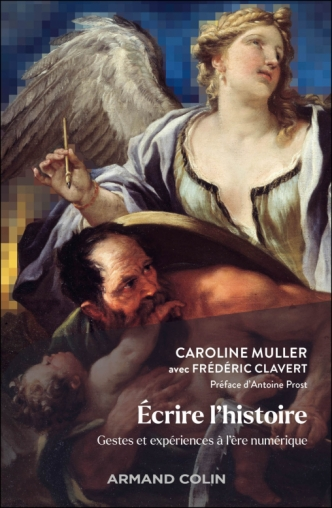
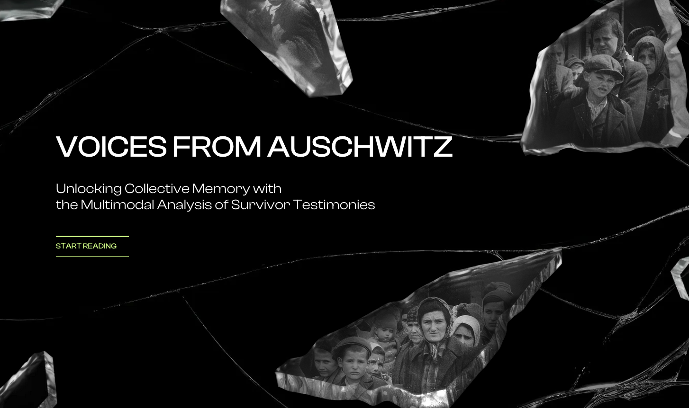
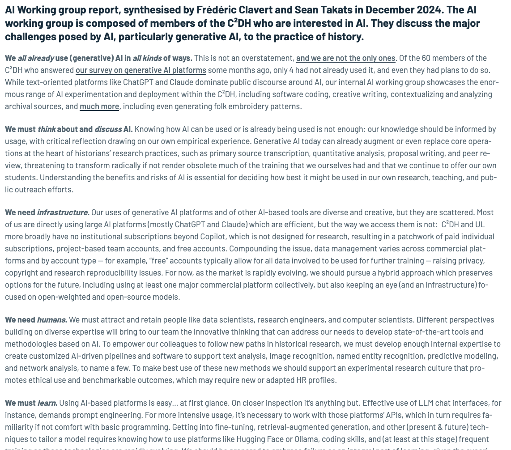

# introduction {data-background="background.jpeg"}

<aside class=notes>

Towards cyborg historians? AI and history in practice: In this  talk, I'll question the transformation of the historian's craft in the age of generative artificial intelligence. Rather than opposing human and machine, I’ll propose thinking about their collaboration through the figure of the "cyborg" — an augmented practitioner whose research gestures (collection, analysis, interpretation, writing) become hybridized with the capabilities of large language models. Among the theme I will evoke, I’ll analyse AI outputs not as mere auxiliary tools, but as "cyborg sources" that reveal the collective imaginaries and temporal and spatial biases embedded in training data. By grounding the reflection in practice — from prompting as a new form of sources to the integration of AI into the daily workflows at C²DH — the aim is to concretely assess what AI does to the historian's craft: what it makes possible, what it distorts, and the epistemological and critical demands it places on anyone who seeks to "prompt the past.”

</aside>

## who am i?

## ai?

<aside class=notes>

What do I mean here by AI? 

In a recent book, emilie bender and alex hanna, *the ai con*, state that basically "AI" is a set of very diverse technologies with no necessary coherences. 

Whatever we think about this book (Bender, Emily M., and Alex Hanna. The AI Con: How to Fight Big Tech’s Hype and Create the Future We Want. Bodley Head, 2025.), this remark should make us aware that we need to be carefull with defining what we are talking about. 

And basically, i'm going to discuss mostly generative ai, already a quite diverse field and that can hide different set of technologies that are not necessarily always very coherent.

Let's take the example of a chatbot. There's a LLM at its root, sure. If it's multimodal, there might be also a diffusion model for images. But between those two kinds of models and the user's interface, this simple interface that is sstandard since the launch of google, there are several layers of technology, as well as usually not advertised configuration (including system prompts that can give a quite different meaning to the users' prompts). 

Furthermore, those same models at the root of chatbots, can have very different uses than chatbots: natural language processing, for instance, argument mining, etc. 

So, even if we focus on generative AI -- which is in the end a kind of machine learning -- we need to admit that we are a lot talking about a concept that hide a very diverse technological reality. It's in a way quite exciting, as it just reminds us of the diversity of our practices, the potentialities of AI for historians.

</aside>

## discrete digital practices

<aside class=notes>

I need also to precise one concept that I am going to use here, which is the concept of "discrete digital practices". Here discrete mostly means 'undocumented'.

It's a concept that we defined with Caroline Muller (Rennes 2) through our research about, to state it fastly, (french) historians' culture in the digital era, and that we are using in this book, mostly written by Caroline and that went out last September.

What do we mean by 'discrete digital practices'? We started our research by trying to imagine what would be the *Allure of the Archive* from French historian Arlette Farge, written in 1989, in the digital era? We progressively turned to analysing the discrepancy between how historians saw their work -- mostly in Arlette Farge's workld -- and how they indeed practice it: the emergence of the digital camera / smartphone in archive centers, the accumulation of pictures of archive in a FOMO style, etc. And we noticed that it opened a space for digital practices that were undocumented, those 'discrete digital practices'. I'll get back to this later.

</aside>

## cyborg?

<aside class=notes>

I'm not the first one to use this word of "cyborg" to caracterize today's historians. In 2012, French historians Nicolas Delalande and Julien Vincent used it to make a portrait of today's historians. A multi-task historians using technology at hand. 

> Delalande, Nicolas, and Julien Vincent. “Portrait de l’historien-Ne En Cyborg.” Revue d’histoire Moderne et Contemporaine, no. 5 (2012): 5–29.

But back to Bender and Hanna, I also like the term 'cyborg' because, though very sci-fi, it send us back to cybernetics and Norbert Wiener. You all know the famous 1956 Dartmouth conference, organised by Marvin Minsky and John McCarthy, that coined the term artificial intelligence. Wiener was not there: there were human problems between Wiener and other researchers, apparently, but the ways they conceptualized computing were also quite different -- and it's a strong argument of Bender and Hanna in their book. To sumarize it a bit too simply, cybernetics is centered around the machine and the information system, whereas 'artificial intelligence' is based on a loose metaphor with the human intelligence. And those are two very different approaches of what we call today 'artificial intelligence'.  

So, using 'cyborg' is a way for me also to go back to a conception of computing that is less based on a comparison with humans, and at the same time, when I talk to historians who are a bit sceptical of AI or digital history, an occasion to provoke a bit :)

</aside>

## the incentives of chatbots: 'prompting the past'

<aside class=notes>

So, as I said, i'll talk about different kinds of AI, but a lot about chatbots. Chatbots, though an old concept -- remember Eliza --, are now a lot forging our imaginaries on AI, right? 

It's not totally innocent. When I look at chatgpt's interface, or the basic claude one (it's different with other products such as Claude Code), they are for me an incentive to ask questions -- as google's interface is, by the way, google that is using machine learning for quite a while now.

Asking question is one of our core task as historians. But one of our core task is also to answer those question based on primary and secondary sources. And it's here that chatbots are different from historians: they answer questions, but most platforms are not giving sources (and when they do, it's not always pertinent). chatbots are blackboxes, so are models.

So, 'prompting the past' -- here an expression that could encompass many uses, by historians, but mostly by non historians -- is not something neutral.

So are historians using AI and how?

</aside>

# are we all using ai?

##

(almost)

<aside class=notes>

18 months ago, my colleague Sean Takats and I organised a poll during a plenary meeting of the C2DH -- 60 members of our staff, researchers, admin and support staff, etc. To the question "Do you use or have you used AI platforms?", 56 members of the C2DH answered yes.  To the following question :"if no, do you intend to?" The 4 remaining colleagues answered 'yes'.

So yes, we are all using AI, at least at the C2DH. I have no doubt that, if we talk about AI platforms *ie* about explicit uses of AI, the C2DH in not the most representative of all research center in history, and we might be overusing AI in comparison to other historians. But we'll see later that there are many other to use AI implicitely.

Let's go back to the C2DH. This poll should not hide the fact that behind this simple question, there are many different uses. 

If we stick to chatbots, we have discussed with PhD students, for instance: they can use it to fight the white page syndrom (they don't keep any word from the chatbot's answer), they can use it for brainstorming.

let's focus on some examples of a bit more elaborated or original uses. 

</aside>

## 

##

## 

## ai working group

<aside class=notes>

- We all already use (generative) AI in all kinds of ways.
- We must think about and discuss AI.
- We need infrastructure.
- We need humans.
- We must learn.
- We need partners. 

We had the chance to have a new professor in History, AI and datamining, Sarah Oberblicher, and we will soon relaunch the AI working group which was on hold for quite a while.

</aside>

# ai as a discrete practice

<aside class=notes>

I started with the experience of the C2DH. Obviously, if we consider this seminar for instance, we are not the only one to think about AI and History, which is definitely good.

But I still believe that there are numerous uses of AI that are not documented today. And those undocumented uses, those discrete digital practices, may well be developping over the next few years, and they probably did for three years now, as generative ai is fastly developping, even if critical ai and other branches of ai have still doubts. 

Let's try to do an assessment of today's situation. We'll investigate, following an article in the French contemporary history journal 20&21 that we published a couple of years ago, by looking at three stages of our research: primary sources, interpretation of those primary sources, writing.

</aside>

## ai and primary sources

<aside class=notes>

At many levels our primary sources are now influenced, based on AI.

- digitized sources: OCR is today based on machine learning, and more and more multimodal AI models,
- search engines (see impresso): NLP based on AI, that will allow for more research
- when it comes to reading those sources, distant reading is for a long time based on machine learning (MALLET the standard software for topic modelling is based on LDA, which is machine learning based)

But those are practices that are rather well documented, even if it's not always obvious for search engines.

There are many discrete practices that are today developping, if I based my appreciation on what I see and what my colleague Caroline Muller has discussed recently.

Let's take the example of the use of smartphones in the archives reading room. The camera, on the software side, of smratphones are usually using algorithms that are based on machine learning to make the image better. In a way, with this practice of taking picture of primary sources, historians are using Ai without kniwing it for quite a while. 

Once you have taken your pictures, you might want to recognize caracters to do full text search. OCR will probably involved some sort of machine learning. Furthermore, it's easier and easier to drop the sources into a chatbot a ask for the text -- which might involves issues: hallucinations, a mix of caracter recognition and analysis.

And there are sometimes even more strange practices. We had this example of a colleague storing all their pictures of archivs on google drive. Google drive will automatically perform OCR on those images and our colleague can do full-text search.

Why are those practices an issue? Basically, because you give up method, because you transfer part of your job to algorithms you do not understand -- and even if you try to understand them, they sometimes remain black boxes.

</aside>

## ai and interpretation

<aside class=notes>

When we have primary sources, we need to interpret them. Let's agree on what we mean here by interpratation: we link primary sources between them, we compare them, we look for incoherences, for what's not in the primary sources, it's not interpertation as in STEM which would be over-interpretation in our case. This work of interpretation is done when we read primary sources. And we have several ways to read those sources: close and distant reading, a mix of both.

We could think that distant reading is the only one based on machine learning / ai. It is true that machine learning is used a lot in distant reading -- I mentionned MALLET, for instance. Today, we can do many things with language models for instance.

But close reading can be assisted, and I think will be assisted, more and more by AI. First because of the way primary sources were collected: as I said, if primary sources are OCRed, then there is already machine learning involved. But not only for that. More and more pieces of software are appearing that make Retrieval Augmented Generation (RAG) possible withoutr any code. What's RAG? basically you are storing your PDFs, images, etc into a vector database, and then you will prompt a model that will retrieve information from this vector database to answer you.

There are always websites allowing you to "talk with your PDF". It's not necessarily RAG, but it's typically the kind of uses that you can also do with RAG: basically, it's AI-assisted close reading.

Hence, there are a full set of questions that comes with that kind of practices -- around ethics, but also methodological questions and the eternal issue of the blackbox.

</aside>

## ai and the writing of history

<aside class=notes>

Last but not least, the wxriting of history. What is going to happen when the pieces of software that are used as standard by historians, ie MS Word, will systematically embark AI? With automatic word suggestions? With the possibilities to ask full paragraphs if not full texts, automatically written by an AI based on the material and some bullet-points written by the historian?

Wulf Kansteiner, in his article in History & Theory, saw language models as a way to evaluate the 'style' of different historiographical schools. But in a way, integrating LLMs to help us writing might lead to a form of standardization of the writing of history. 

Nietzsche considered that using a machine to write -- he did the experiment -- changed his style, making it more direct, more brutal. Why wouldn't AI based writing have an influence on ohow we write?

</aside>

# conclusion: towards the cyborg historians

<aside class=notes>

To my mind, our first mission today is to explicit our practices. It is obviously what we have tried to do with the C2DH AI working group, at our level.

What is still unclear to me is: how to do it?

AI as we understand it today (ie LLMs, diffusion models, chatbots) is basically percolating in all our practices, but also with phenomena of rejection that can be quite tough and that can encourage some colleagues not to advertise what they do with AI.

Furthermore, the line between legitimate uses of AI and fraud might be quite thin, and is not the object of a consensus today. So we need to work toward a consensus.

But my opinion is that expliciting our practices and working on a censensus might not be really enough. Hence, the idea of the cyborg historian.

</aside>

## towards cyborg historians

<aside class=notes>

In the abstract that I sent for today - and when I read it again today and compared it to this presentation, it looks much more ambitious that what I just said - i described the cyborg historian as such: “an augmented practitioner whose research gestures (collection, analysis, interpretation, writing) become hybridized with the capabilities of large language models."

The hybridization is here quite important. But what is missing here is that to be fully 'augmented', the historians must explicit their uses, insert them into their methodology, and, to my mind, think collectively about the consequences of this hybridization.

In my ideal world, a cyborg historian is not only a historian able to use AI in a methodologically sound manner, considering many ethical and epistemological issues. It's also a historian who is better because they precisely know what they are doing and hence can forge a method that is adapted to their research questions.

</aside>

## bibliography

<small>

Bender, Emily M., and Alex Hanna. The AI Con: How to Fight Big Tech’s Hype and Create the Future We Want. Bodley Head, 2025.

Delalande, Nicolas, and Julien Vincent. “Portrait de l’historien-Ne En Cyborg.” Revue d’histoire Moderne et Contemporaine, no. 5 (2012): 5–29.

Clavert, Frédéric, and Caroline Muller. “L’histoire au temps des algorithmes: Une réflexion prospective sur l’introduction de l’intelligence artificielle en histoire au 21e siècle.” 20 & 21. Revue d’histoire 162, no. 2 (2024): 13–26. https://doi.org/10.3917/vin.162.0013.

Muller, Caroline. Écrire l’histoire : Gestes et expériences à l’ère numérique. Armand Colin, 2025. https://www.smithandson.com/livre/9782200642020-ecrire-l-histoire-gestes-et-experiences-a-l-ere-numerique-frederic-clavert-caroline-muller/.

Kansteiner, Wulf. “Digital Doping for Historians: Can History, Memory, and Historical Theory Be Rendered Artificially Intelligent?” History and Theory 61, no. 4 (2022): 119–33. https://doi.org/10.1111/hith.12282.

</small>

